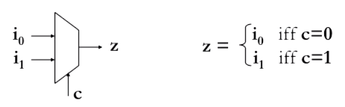
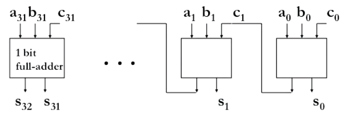
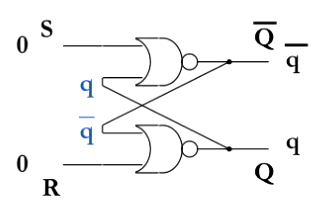
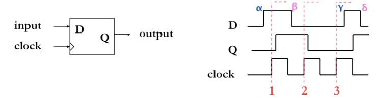
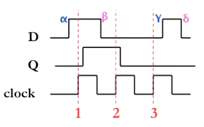
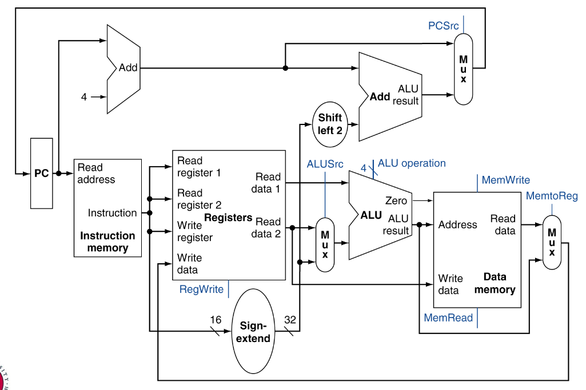
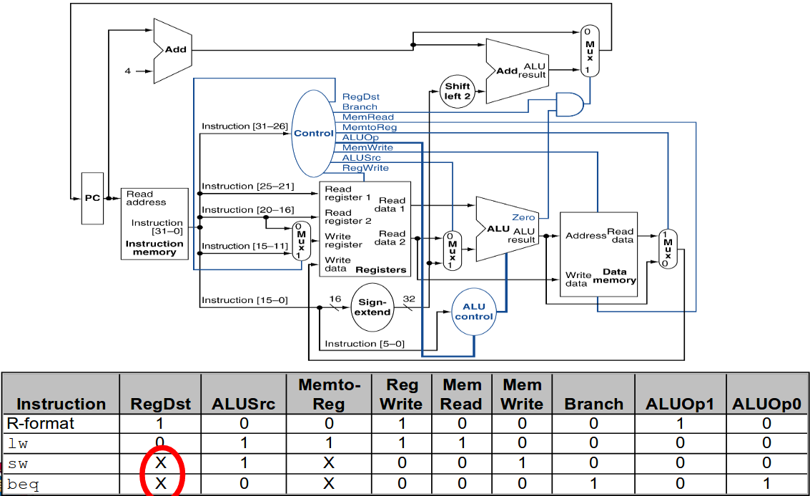
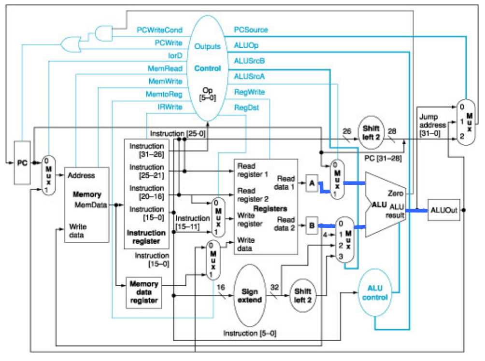

## Floating point

Mantissa/significand
:   Fractional part

Exponent
:   Power of £2£

> Convert £25_{10}£ in floating point form
>
> £25_{10} = 011001_2£
>
> £1.1001 \times 2^4£

### Why normalize?
1. Simplifiys machine representation
2. Simplifys comparisons e.g. $0.00000101$ vs $0.000001$
3. More compact for small/large numbers

### IEEE 654 Floating Point Standard

- 1'st bit is sign bit (£s£)
- 8 bits for exponent (£exp£)
- rest for mantissa (£m£)

Encoding:
£s \times m \times 2 ^ {exp - 127}£

(127 is the __bias__)

£0.75_{10} = 0.11_2 = {(1.1 \times 2^{-1})}_2£

### Why bias?

- Exponent can always be positive (no need to store sign bit)
- Simplifys comparison operations

### Special values

| Exponenent | Mantisa | Number |
| --- | --- | --- |
| 0 | 0 | 0 |
| 1-254 | Anything | Floating point number |
| 255 | 0 | Infinity (signed) |
| 255 | non-zero | NaN (not a number) |

## MIPS

ISA
:   Instruction set architecture - The interface between the hardware and the software

MIPS
:   A real world ISA used by many diffrent processors since the 80s

### Instruction set

Assemble Language
:   Symbolic representation of machine instructions.

Machine code are instructions stored as binary values, assembly language is a one-to-one mapping that allow human programmers to reason about programs.

High level:
```
a[0] = b[0] + 10
```

MIPS:
```
lw r4, 0(r2)    # Load word - Get the value fo b[0] from memory and store in r4
add r5,r4,10    # Add - Compute b[0]+10 and store in r5
sw r5,0(r1)     # Save word - Store r5 into a[0]
```

MIPS does not allow accessing and operating on data at the same time

### Arithmatic and Logical Operations

- `add a, b, c` £a = b + c£
- `sub a, b, c` £a = b - c£
- `sll a, b, c` £a = b << c£
- `srl a, b, c` £a = b >> c£ (logical)
- `sra a, b, c` £a = b >> c£ (arithmatic)

### Registers

Register
:   Storage locations inside the processor that holds program variables and control state

- Some registers are special purpose
    - Register `$zero` is always zero for example
    - `$pc` is the program counter, the adress of the next instruction
    - `$ra` stores the return adress to return to after executing a method
- Most are for general use
    - `$s0-$s7` are variables
    - `$t0-$t9` are tempory variables

### Endinness

Endinness
:   The sequential order in which bytes are arranged in memory

Big-endian
:   Bytes orders by most significant bit

Little-endian
:   Bytes ordered by least significant bit

### MIPS instruction format

Each assembly instruction translates into 1 machine instruction. Their are 3 formts of instructions

- R-format (e.g. `add`, `sub`, `and`, `or` ...) %
\begin{tabular}{|c|c|c|c|c|c|}
\hline
op & rs & rt & rd & shamt & func \\ \hline
6 & 5 & 5 & 5 & 5 & 6 \\ \hline
\end{tabular}
%

- I-format (e.g. `addi`, `lw`, `sw`, ...) %
\begin{tabular}{|c|c|c|c|}
\hline
op & rs & rt & immediate \\ \hline
6 & 5 & 5 & 16 \\ \hline
\end{tabular}
%

- J-format (`j`) %
\begin{tabular}{|c|c|}
\hline
op & target \\ \hline
6 & 26 \\ \hline
\end{tabular}
%

### MIPS examples

#### Swap

This function swaps two consecutive array elements 
```mips
# Compute the adress of the array
sll $t0, $a1 2      # reg $t0 = idx * 4
add $t0, $a0, $t0   # reg $t0 = v + (idx * 4)
                    # $t0 holds the address of array[idx]

# Load the two values to be swapped
lw $t1, 0($t0)      # reg $t0 = array[idx]
lw $t1, 4($t0)      # reg $t0 = array[idx + 1]

# Store the swapped values back in memory
sw $t2, 0($t0)      # array[idx] = $t2
sw $t1, 4($t0)      # array[idx+1] = $t0
```

#### If

```mips
beq $s1,$s2,label2      # if(s1 == s2) jump to label2
stmnt1                  # else
j label3 # skip stmnt2  # continue from label3
label2: stmnt2          # body of if
label3: stmnt3          # continue from if
```

#### Loop

```mips
loop:
    beq $s1,$zero,end               # $s1 holds count
    ...                             # Body of loop                           
    j loop                          # Jump back to start
end:
    ...
```

### Method calls

To jump into a method use `jal label` (jump and link) which:

1. Sets `$ra` to `$pc + 4` (the next instruction)
2. Sets `$pc` to the adress of the label

When returning user `jr $ra` (jump register) which:

1. Sets `$pc` to the value of `$ra`, the adress we want to return to

#### Convention

It is convention to use registers in a certain way

- `$a0` - `$a4` as method parameters
- `$r1` and `$r2` as return values
- `$s0` - `$s7` are preserved across call boundrys
- `$t0` - `$t9` are _not_ preserved across call boundrys

#### Nested calls

If we have a nested call, we can store the return adress onto the stack allowing us to nest "infinitly" (or until the machine runs out of stack space)

To push a word:

1. Move the stack pointer down with `addi $sp, $sp, -4`
2. Save the return adress onto the stack `sw $ra 0($sp)`

To pop a word:

1. Fetch return adress from the stack `lw $ra, 0($sp)`
2. Move stack pointer up with `addi $sp, $sp 4`

The stack is also used to:

- Save `$s` registers
- Pass and return values if their isnt enough registers
- Local variables inside a function (that dont fit into registers)

## Logic design

Combinational logic
:   Out depends on the current input (no memory)

Sequential logic
:   Output depends of current input and some previous inputs (requires memory)

### Combinational logic circuits

| Name | Description |
| --- | --- |
| Inverter / NOT gate | Inverts the input signal |
| OR gate | Outputs 1, if atleast one input is 1 |
| AND gate | Outputs 1, if both inputs _are_ 1 |
| NAND gate | Outputs 1, if bot inputs _are not_ 1 |

Functional completeness
:   Set of gates that can express _any_ boolean function.

Functional-complete sets:

- AND + OR + NOT
- NAND
- NOR

### Multiplexer 

Multiplexer
:   Selects one of multiple inputs



To convert this curcuit to logical gates, we look at its truth table

%
\begin{tabular}{c|c|c|c}
$c$ & $i_0$ & $i_1$ & $z$ \\ \hline
0 & 0 & 0 & 0 \\
0 & 0 & 1 & 0 \\
0 & 1 & 0 & 1 \\
0 & 1 & 1 & 1 \\
1 & 0 & 0 & 0 \\
1 & 0 & 1 & 1 \\
1 & 1 & 0 & 0 \\
1 & 1 & 1 & 1 \\
\end{tabular}
%

Next we look at all the cases where the output is £1£. And all the inputs and or each of these cases to get the following:

%
\begin{align*}
z &= \bar{c} . i_0 . \bar{i_1} + \bar{c} . i_0 . i_1 + c . \bar{i_0} . i_1 + c . i_0 . i_1 \\
&= \bar{c} . i_0 . (\bar{i_1} + i_1) + c . i_1 . (i_0 + \bar{i_0}) \\
&= \bar{c} . i_0 + c . i_1 \\
\end{align*}
%

This is the sum of products form.

### Arithmetic

If we used sum of products form for an adder (adds two binary numbers together), their would be way to many curcuits to reason about with 32/64 inputs. Instead we sequence a smaller curcuit.

Full / 1-bit adder takes in 2 digits and a carry, produces result digit and carry out. We then use multiple copys to create a 32-bit adder (ripple carry adder):



### Propagation delay

Propagation delay
:   Time delay between input signal change and output signal change.

The propagation delay depends on:

- Technology (transistor parameters, wire capacitance, etc).
- Delay through gate
- Number of gates

## Sequential logic

Sequential logic
:   Output depends on current and past input(s), i.e. the curcuit has memory.

### SR Latch

The SR latch is the simplest form of memory.



It has the following truth table

%
\begin{tabular}{c|c|c}
$S$ & $R$ & $Q_i$ \\ \hline
0 & 0 & $Q_{i-1}$ \\
0 & 1 & 0 \\
1 & 0 & 1 \\
1 & 1 & invalid \\
\end{tabular}
%

### Clock

We know the because of propagation delay, curcuits with lots of gates take some time to output. Outputs may also fluctute if certain paths are shorted than others. The clock forces all state changes to happen when its 1, and guarentees the state is correct while it is 0, thus we avoid any occilation effecting calculations.

### Level-triggered D Latch

A latch which only only changes when the clock is 1.



For example £\alpha£ changes before £1£, but £Q£ wont change until after £1£.

### Edge-triggered D flip-flop

We can do better. Half a clock cycle is still alot of time, thus an edge-triggered D flip-flop will only change when the input changes on a _positive clock edge_.



For example £\Gamma£ doesnt cause a change since it happens after the clock edge.

### General sequential logic curcuit

Now if we tie multiple D flip-flops together (with a common clock) we get a register. Combine this with some combinational logic (whos state is saved by the registers to be used next cycle) and we arrive at a general sequential logic circuit.

### Hardware FSM

We can use FSM to derive the seqential logic curcuit.

## Processor Design - Single Cycle

Datapath
:   Performs the data operations as controlled by the instructions

Control
:   Controls the datapath, memory and I/O as controlled by the instructions

### Main functions

- __Fetch__ instructions from instruction memory
- Read the register operands
- Use the ALU for computation
    - Arithmetic
    - Memory adress
    - Branch target
- Access data memory for load/store
- Store the result of the computation/data into the destination register
- Update the program counter (PC)

### R-Format instructions

1. Read two register operands
2. Perform the arthemetic/logical operation
3. Write register result

### Load/Store instructions

1. Read register operands
2. Calculare adress using 16-bit offset
    - Use ALU with sign-extend
3. Read (for load) or write (for store) the memory.
4. (Load only) Update destination register

### Branch instructions

1. Read register operands
2. Compare operands
    - Use ALC, subtact and check Zero output
3. Calculate target adress
    - Sign-extend the immediate
    - Shift left 2 places (word align)
    - Add to PC + 4
    
### Full Datapath



### Control part

The control component produces the signals that control the datapath by looking at the 6 bit op code.    



### ALU control

ALU operations:

| Type | Operation |
| --- | --- |
| Data transfers | Add |
| Branches | Sub |
| Other | Look at func field |

Other operations:

- `0000` - AND
- `0001` - OR
- `0010` - add
- `0110` - subtract
- `0111` - set-on-less than

## Processor Design - Multicycle processer

Motivations for multicycle processors:

- __Speed:__ In a single cycle processor, the clock cycle must be long enough for the most complex instruction.
- __Cost:__ Functional units (adders e.g.) cannot be re-used during instruction execution.

Basic idea:

- Break up execution of instructions to multiple cycles
- Ensure actions performed in a cycle are generic (common to many instructions)
- Reuse datapath and control path components

### Building blocks

- One memory
    - Shared between instructions and data
    - Common interface given an indress and data to write, produces the read data.
- Registers
    - Read early in instruction cycle
    - Written late
    - No chance of read/write contention
- One ALU
    - All PC calculations
    - All arithmetic

### Example execution

`<=` means the register "get the value of" at the end of the clock cycle.

#### Fetch
1. 
```
IR <= Mem[PC]1
PC <= PC + 4
```

2. Read registers
```
A <= Reg[IR[25:21]] // adress the register denoted by the instruction
B <= Reg[IR[20:16]]
ALUOut <= PC + sgnext(IR[15:0] << 0) // compute branch offset
```
3. - R-type arithmetic
```
ALUOut <= A op B
```
- Imediate arithmetic
```
ALUOut <= A + sgnext(IR[15:0])
```
- Branch completion
```
if(A == B) PC <= ALUOut
```
- Jump completion
```
PC <= {PC[31:28], IR[25:0], 2'b00} // 4 most significant bits + jump adress + 00
```

4. Perform store

### Data and control path



- New instruction register to store currently executing instruction
- A & B read register
- ALU mux to control ALU inputs and operations
- ALU out register
- Memory data register (stores data from memory)

## Memory

Temporal locality
:   Recently accessed memeory location is likely to be accessed again in the near future.

Spatial locatility
:   Memory location close to recently accessed location are likely to be accessed in the near future.

### Memory hierachy

- Temporal locality
    - If access data from slower memeory, move to faster memory
    - If data is faster memeory unused recently, move it to slower memory

- Spartial locality
    - If need to move a word from slower to faster memory, move adjacten words
    - Gives rise to blocks and pages, units of storage for contiguous memory.

### Terminology

Block (or line)
:   Unit of data stored in the cache

Hit
:   Data is found in the cache

Miss
:   Data not found

Hit rate
:   Fraction of accesses that are hits at any given level of hierarchy

Hit time
:   Time required to access a level of the hierarchy, including time to determin wherer acess hit or miss

Miss penalty
:   Extra time required to fetch ablock in the next level down

### Cache

Tag
:   A word indicating the address of the main memroy block it holds (a subsection of the adress)

Valid bit
:   Indicates the block is in use

### Fully-associative cache

The tag is all of the bits an the adress except from the block offset. The byte offset is comprised of the lowest bits that denote the requested byte with in the cache block.

### Cache replacement

Least recently used (LRU)
:   Evict the cache block that hasnt been accessed in the longest time

First in first out (FIFO)
:   Replace in the same order as filled

### Direct-mapped cache

A data item can be stored in one location only in the cache. The adress is split into the tag, index and byte offset. The index tells us where the memory is found/stored. If the tag in that position is the same, then their is a hit, otherwise its a miss.