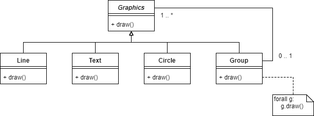

## Use Cases

Use case
:   A task involving the system which has value for one or more stakeholders.

Actors
:   A stakeholder who takes an active part in the use case.

Primary Actor
:   Stakeholder with primary intrest in use case (usually the one triggering the use case).

Supporting actors
:   Actors also envolved

Some stakeholders may not be participating in a use case (so neither primary or supporting actors).

Actors can be:

- Users of a system
- An external system, which interacts with the system

Usually a use case is a sequence of steps, however they may other paths, they may succeed, fail, or succeed in an alternate way.

### Example

Main success scenario
```
1. Customer selects item
2. Customer checks out
3. ...
4. Email confirmation
```

Extensions - variations of the main success scenario

```
6a. Credit card auth fails
    .1 Re-enter details
```

### Use case templates

- __Goal:__ What the primary actor wishes to acheive
- __Summary:__ Description of use case
- Stakeholders and each’s Interest in the use case
- Primary actor
- Supporting actors
- __Trigger:__ The event that leads to this use case being performed.
- __Pre-conditions/Assumptions:__ What can be assumed to be true when the use case starts
- __Guarantees:__ What the use case ensures at its end
    - Success guarantees
    - Failure guarantees
    - Minimal guarantees
- Main Success Scenario
- Alternative scenarios

A use case can:
- Diffrent levels of detail
    - Depending on part of development process
- May refer to other use cases
- Descripe diffrent scopes

### Requirements capture

1. Identify actors
2. For each actor
    - What do they need
    - Any other expected interactions
    - Which use cases have priority
    
Use cases are often functional requirements, with non-functional requirements attached. Other times. Non-functional requirements apply to subsets or all of use-cases.

### Other uses

- Drive design
- Design validation
    - Does the design work
- Testing
    - Good source for system tests
    
### Problems

- May be to much detail (constraining design)
- Supporting actors may not be strictly necessary i.e. librarian may not be involved in borrowing a book (in a modern library)
- Less attension to architecture and static object structure.
- May miss requirements not associated with actors.

## Design

Design
:   How softawre will meet the requirements

Outputs of design:

- Models
    - UML / SImulink
    - Often graphical
    - Can be executable
- Written documents
    - Record reasons for decisions (
    - trace back when problem occors to relevent stakeholder

Criteria:

- The design can meet the requirements
- Is it maintainable?
- Can it be explained to implementors
- Fits constraints of exsisting technology (legacy components)
- Makes future design choices easy

High level (architectural) design
:   How subsytems are split up

Low level (detailed) design
:   How subsystems are composed

At each level:

- What are the responsibilities of each component?
- what are the interfaces?
- What are the messages exchanged (what protocols)?

Architecture
:   The way that components work together.

- What are the components
    - Where shall we put the encapsulation barriers?
    - Which decisions do we want to hide inside components (so they can be changed without effecting the rest of the system)?
    
- What are the connectors?
    - How/what do the components need to communicate?
    - What should be the interfaces?
    - What protocols should be used?
    
### More architecutral decisions:
- What language and/or component standard is going to be used?
- Is their an appropriate exising framework?
- What conventions for error handling?
    - backups
    - resiliance
    - fail gracefully
    
## Detailed design

- Architecture has be designed
- Each person/team is in charge of designing one subsystem
- What external interfaces must it work with?
- What classes and behaviour are needed?
- Coordination with system architect to change interface if required.

### Principles

Cohesion
:   A mesure of the strenth o fthe realationship between the pieces of functionality within the component. High cohesion has increased understandability, maintainability and reliability.

Coupling
:   A mesure of the strength of the inter-connection between components. Loose coupling increases understandability and maintainablilty.

Abstraction
:   A view of some entity that focuses on the infomation relevent to a particular purpose.

Encapsulation
:   Grouping and packaging the elements and internal details of an abstraction and making those details inaccessible.

Seperation of interface/implementation
:   Specifing a public interface, known to the clients, separate from the details of how the component is realized.

Decomposition
:   Divinding large systems into smaller components with distinct responsibilitys.

## Modeling

Model
:   A precise represntation of some of the information needed to solve a problem using a computer.

A UML model
- represented by set of diagrams
- structured represnetation too (XML)
- must obey rules of UML standard
- (fairly) precise meaning
- Used informally (talking around whiteboard)

### Big design up front

- Often unavoidable
- If done right, simplifys developent
- Error prone (changing requirements)
- Wastefull (mistakes in requirements)

XP maxinms:

- You aint going to need it
- Do the simplest thing that could possibly work

## Dynamic aspects of design

Their are two types of behaviour within OO systems

Inter-object bhaviour
:   Who sends whcih messages to whom?

Intra-object behaviour
:   What state changes does each object undergo as it revieves messages? How does this effect its behaviour?

### Inter-object behaviour

- Classes should correspond to domain consepts
- Data encapsulated should match real world model
- Work out what operations are needed for the usecases

It may not be obvious when several objects that have to collaborate. CRC cards can help.

### Interaction diagrams

Describes dynamic interactions, good for showing how the system realized a use case. UML has two diagrams, sequence and communication diagrams.

1. Decide exactly what behaviour to model
2. Name the objects which are involved
3. Identify the sequence of messages which objects sends
4. Record this in the syntax of an interaction diagram

### Good interaction diagrams

Conceptual coherence
:   Does it make sence for thus class to have that operation

Maintainability
:   Which aspects might change, how hard woull it be to change the itnterataction

Performance
:   Is all the work being done neccessary

### Reducing long-range coupling

Consider three classes `A`, `B`, `C` where `A -> B -> C`. If `A` needs some data from `C` one approach would be for `B` to return a reference to `C`. However, this means `A` and `C` are tightly coupled.

A better approach is for `B` to exactly what `A` needs from `C`, thus `A` is no longer coupled to `C`.

#### The Law of Demeter

The Law of Demeter is a design prenciple ro reduce long range coupling. In responce to a message `m`, an object `O` should send messages only to the following objects:

- `O` itself
- objects which are arguments to message `m`
- objects which `O` creates as part of its reaction to `m`
- Objects which are directly accessible from `O`, that is, using values of attributes of `O`

## Design patterns

Design pattern
:   A names, well understood good solution to a common problem.

### Composite design pattern

Consider a graphics library which supports various operations such as move, draw, change color. These operations chould apply to a single object, or a tree of connected objects.



The composite design pattern introduces another subclass `group` of the abstract class `graphics` which has a reference to all the graphics in that group. The group itself is a `graphics`, so it can be a subgroup of some other `group`.

The benifits

- Allows trees of any depth
- New subclasses dont require any additionaly methods to support the tree structure.

The drawbacks

- May cause maintance issues (draw methods split along many files)
    - One solution would be the visitor pattern  

### Observer pattern

The observer pattern has an object called the `subject` which has a collection of `observers` that it notifys automaticly when any state changes.


### Template method pattern

The skeleton of an algorithum is defined, defferings certiain steps to subclasses. This allows modification of parts of the algorithum, without changing its original structure. Consider a sorting algothum. For the comparison step, several subclasses can be made such as `IntCompare` and `StringCompare` so that the algorithum can be used not just with numbers but other types aswell.


### Elements of a pattern

- Name
- Aliases (other names for a pattern)
- Context (where the problem arrises?)
- Problem (why a naive approach wont work?)
- Solution (mixture of text and models)
- Consequences (benifits/drawbacks)

## High quality code

- Codeing standards
    - Placement of braces
    - Indenting
- Use meaningfull names
    - If they become out of date, refactor them
- Avoid cryptic comments
    - Try to make code clear instead of comments
- Balance structual complexity vs code duplication
    - Dont repeat yourself
    - Avoid costly changes just to avoid writing somthing twise
- Be clever, but no too clever
    - Avoid deprecated, obscure or unstable language features
    - Premature optermization is the root of all evil...
- Remove dead code, unneeded packages, etc

### Documentation

Any software projects require documentation for end users. Most languages have doc tools that allow embedded documentation in the code to be transformed into a html page, or other display format.

### Coding style

- Declarations and local variables
    - Limit scope of local variables
- Conditional and loop statements
    - Put the common case first, any exceptions after
    - Avoid deep nesting
- How code is split
    - Avoid long methods
- Defensive programming
    - Use assertions
    - Handle errors appropriately
- Use suitable OO patterns
- Divide code into packages
    - Allow related pieces of code to be grouped
    - Units of encapsulation
        - Fields and methods by default are visible to packages
    - Organize namespace

### OO Features

- Classes
    - Grouping behaviour
    - Concetual abstraction
    - Hides state
- Inheritance
    - Doesnt need to know of private class members
- Interfaces
    - Decouple implementations from users

## Version control

## Refactoring

## Verification, Validation and Testing

### Java Modeling language

JML is a richer language for writing conditions e.g. quantifiers.

- Preconditions: `//@ requires x > 0;`
- Postconditions: `//@ ensures \result % 2 == 0`
- Invariants: `//@ invariant name.length <= 8`
- General assertions: `//@ assert i + j = 12;`

#### Dynamic analysisi

Running the program with assetions is a basic form of dynamic analysis, their are tools that can compile JML to java to test at runtime

#### Static analysis

Some tests can be run at compile time

- Checks code oversights, e.g. did you check if the file exsists
- Corectness of pre/post condtions of some methods
- Concurrency bugs e.g race conditions

## Deployment and Maintance

- Business process: Most software requires the customer to change the way they word, has this been thought through?
- Training: No point deploying it if the customer can use it.
- Deployment itself: How the software is physicaly installed
- Equipment: Is the computer systems compatible
- Expertices: Is their the personal to marage the deployment
- Integration with the businesses other software

### Deployment

- Package software
- Make it availble (cd, usb, internet etc)
- Turn key installers
    - Check dependencys
    - Install software
    - Check lisences

### Maintance

- Fixing bugs and vulnerabilites (including problems in the original design).
- Adapting to new platforms and software enviroments.
- Supporting new features and reqirements.

### Maintance challenges

- Often a new team maintance software
- Development vs maintance often seperate contracts, developers dont have insentive to make it maintanable
- Unpopular, less skilled, involve obselete languages
- Structure degrades
- Compilers stops working, documentation goes unmaintained

### Software evolution

- Gather change requirements
    - New features
    - Adapting to buissness changes
    - Bug reports
- Evaluate, produce list of changes
- Go through the normal development cycle
- Issue the new release

In the case of emergency, this process is often shortcurcuited.

### Re-engineering

Re-engineering is the process of transforming old software until its maintainable

- _Source code translation_ from obsolete languages.
- _Reverse engineering_ analyse the program to derive the code in the case were the source code has been lost.
- _Structure improvement_, i.e. modularization, architercural refactoring.
- _Data re-enginerring_, reformatting and cleaning up data.
- _Adding adaptor interfaces_ to users and newer software. 

## Bug Reporting

Many projects use _bug tracking systems_ for both bug reports and feature requests. They provide receving, tracking, notifying and monitoring to ensure bugs and features are followed through.

### Writing a bug report

- Keep the report concise
- Include tediously detailed infomation
    - How can you reporoduce it?
    - List everything you did in order.
- Include full infomation about the computer system
- Make an attempt to diagnose the problem

